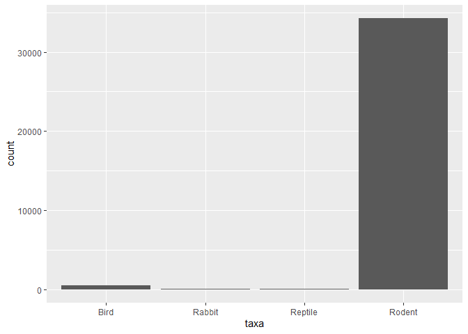
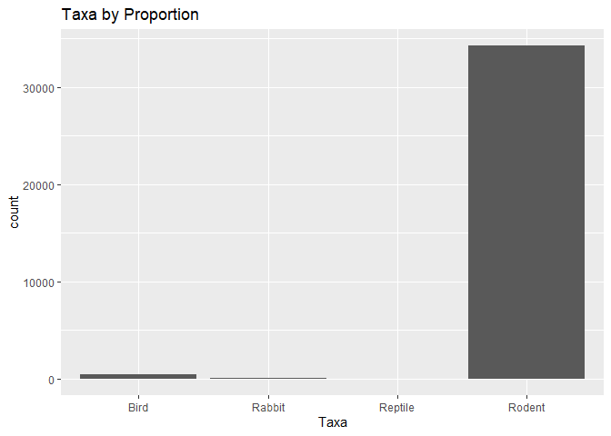
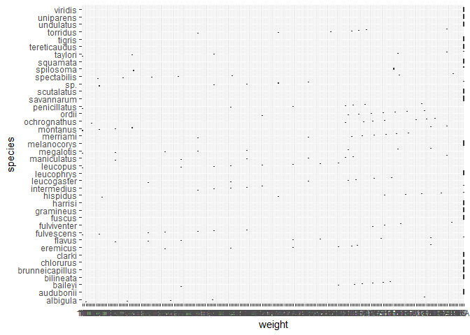
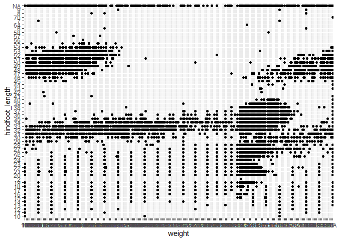
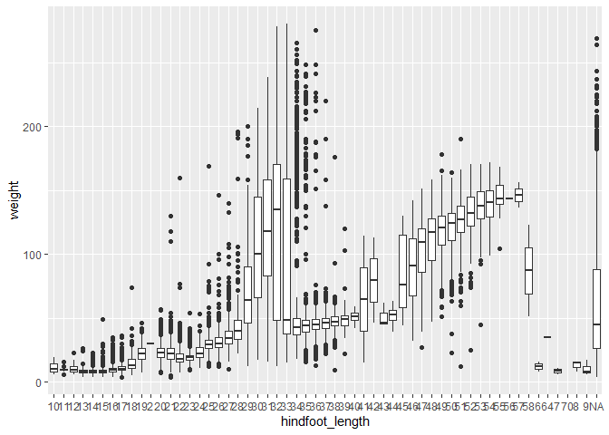
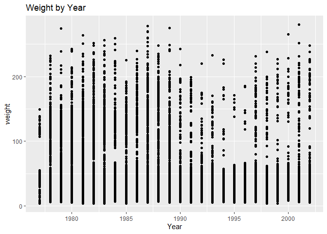

#Placeholder to look at when I'm home:
Look at this [data set](https://www.kaggle.com/datasets/antaresnyc/human-gut-microbiome-with-asd) maybe? 

## Instructions
Answer the following questions and complete the exercises in RMarkdown. Please embed all of your code and push your final work to your repository. Your final lab report should be organized, clean, and run free from errors. Remember, you must remove the `#` for the included code chunks to run. Be sure to add your name to the author header above. For any included plots, make sure they are clearly labeled. You are free to use any plot type that you feel best communicates the results of your analysis.  

Make sure to use the formatting conventions of RMarkdown to make your report neat and clean!  

## Load the libraries

```r
library(tidyverse)
library(janitor)
library(here)
library(naniar)
```

## Desert Ecology
For this assignment, we are going to use a modified data set on [desert ecology](http://esapubs.org/archive/ecol/E090/118/). The data are from: S. K. Morgan Ernest, Thomas J. Valone, and James H. Brown. 2009. Long-term monitoring and experimental manipulation of a Chihuahuan Desert ecosystem near Portal, Arizona, USA. Ecology 90:1708.

```r
deserts <- read_csv("data/surveys_complete.csv", na="-999")
```

```
## Rows: 34786 Columns: 13
## ── Column specification ────────────────────────────────────────────────────────
## Delimiter: ","
## chr (8): species_id, sex, hindfoot_length, weight, genus, species, taxa, plo...
## dbl (5): record_id, month, day, year, plot_id
## 
## ℹ Use `spec()` to retrieve the full column specification for this data.
## ℹ Specify the column types or set `show_col_types = FALSE` to quiet this message.
```

1. Use the function(s) of your choice to get an idea of its structure, including how NA's are treated. Are the data tidy?  


```r
clean_names(deserts)
```

```
## # A tibble: 34,786 × 13
##    record…¹ month   day  year plot_id speci…² sex   hindf…³ weight genus species
##       <dbl> <dbl> <dbl> <dbl>   <dbl> <chr>   <chr> <chr>   <chr>  <chr> <chr>  
##  1        1     7    16  1977       2 NL      M     32      NA     Neot… albigu…
##  2        2     7    16  1977       3 NL      M     33      NA     Neot… albigu…
##  3        3     7    16  1977       2 DM      F     37      NA     Dipo… merria…
##  4        4     7    16  1977       7 DM      M     36      NA     Dipo… merria…
##  5        5     7    16  1977       3 DM      M     35      NA     Dipo… merria…
##  6        6     7    16  1977       1 PF      M     14      NA     Pero… flavus 
##  7        7     7    16  1977       2 PE      F     NA      NA     Pero… eremic…
##  8        8     7    16  1977       1 DM      M     37      NA     Dipo… merria…
##  9        9     7    16  1977       1 DM      F     34      NA     Dipo… merria…
## 10       10     7    16  1977       6 PF      F     20      NA     Pero… flavus 
## # … with 34,776 more rows, 2 more variables: taxa <chr>, plot_type <chr>, and
## #   abbreviated variable names ¹​record_id, ²​species_id, ³​hindfoot_length
```

```r
any_na(deserts)
```

```
## [1] FALSE
```

```r
glimpse(deserts)
```

```
## Rows: 34,786
## Columns: 13
## $ record_id       <dbl> 1, 2, 3, 4, 5, 6, 7, 8, 9, 10, 11, 12, 13, 14, 15, 16,…
## $ month           <dbl> 7, 7, 7, 7, 7, 7, 7, 7, 7, 7, 7, 7, 7, 7, 7, 7, 7, 7, …
## $ day             <dbl> 16, 16, 16, 16, 16, 16, 16, 16, 16, 16, 16, 16, 16, 16…
## $ year            <dbl> 1977, 1977, 1977, 1977, 1977, 1977, 1977, 1977, 1977, …
## $ plot_id         <dbl> 2, 3, 2, 7, 3, 1, 2, 1, 1, 6, 5, 7, 3, 8, 6, 4, 3, 2, …
## $ species_id      <chr> "NL", "NL", "DM", "DM", "DM", "PF", "PE", "DM", "DM", …
## $ sex             <chr> "M", "M", "F", "M", "M", "M", "F", "M", "F", "F", "F",…
## $ hindfoot_length <chr> "32", "33", "37", "36", "35", "14", "NA", "37", "34", …
## $ weight          <chr> "NA", "NA", "NA", "NA", "NA", "NA", "NA", "NA", "NA", …
## $ genus           <chr> "Neotoma", "Neotoma", "Dipodomys", "Dipodomys", "Dipod…
## $ species         <chr> "albigula", "albigula", "merriami", "merriami", "merri…
## $ taxa            <chr> "Rodent", "Rodent", "Rodent", "Rodent", "Rodent", "Rod…
## $ plot_type       <chr> "Control", "Long-term Krat Exclosure", "Control", "Rod…
```
NA's are simply listed as NA. Any -999 has been set to an NA, as -999 does not functionally make sense for any column. Every row and column cell has an element or value. Data should be tidy.

2. How many genera and species are represented in the data? What are the total number of observations? Which species is most/ least frequently sampled in the study?


```r
deserts %>%
  count(genus, sort=T)
```

```
## # A tibble: 26 × 2
##    genus                n
##    <chr>            <int>
##  1 Dipodomys        16167
##  2 Chaetodipus       6029
##  3 Onychomys         3267
##  4 Reithrodontomys   2694
##  5 Peromyscus        2234
##  6 Perognathus       1629
##  7 Neotoma           1252
##  8 Ammospermophilus   437
##  9 Amphispiza         303
## 10 Spermophilus       249
## # … with 16 more rows
```

```r
deserts %>%
  count(species, sort=T)
```

```
## # A tibble: 40 × 2
##    species          n
##    <chr>        <int>
##  1 merriami     10596
##  2 penicillatus  3123
##  3 ordii         3027
##  4 baileyi       2891
##  5 megalotis     2609
##  6 spectabilis   2504
##  7 torridus      2249
##  8 flavus        1597
##  9 eremicus      1299
## 10 albigula      1252
## # … with 30 more rows
```
Merriami has the highest observations. There are multiple species tied for the lowest observations.

3. What is the proportion of taxa included in this study? Show a table and plot that reflects this count.


```r
deserts %>%
  ggplot(aes(x=taxa))+geom_bar()
```

<!-- -->

```r
deserts %>%
  group_by(taxa) %>%
  count(taxa)
```

```
## # A tibble: 4 × 2
## # Groups:   taxa [4]
##   taxa        n
##   <chr>   <int>
## 1 Bird      450
## 2 Rabbit     75
## 3 Reptile    14
## 4 Rodent  34247
```


4. For the taxa included in the study, use the fill option to show the proportion of individuals sampled by `plot_type.`


```r
deserts %>%
  group_by(taxa, record_id) %>%
  count(taxa,sort=T) %>%
  ggplot(aes(x=taxa, fill = record_id))+geom_bar()+labs(title="Taxa by Proportion", x = "Taxa", fill ="Record ID")
```

```
## Warning: The following aesthetics were dropped during statistical transformation: fill
## ℹ This can happen when ggplot fails to infer the correct grouping structure in
##   the data.
## ℹ Did you forget to specify a `group` aesthetic or to convert a numerical
##   variable into a factor?
```

<!-- -->


5. What is the range of weight for each species included in the study? Remove any observations of weight that are NA so they do not show up in the plot.


```r
deserts %>%
  group_by(species) %>%
  ggplot(aes(x=species,y=weight))+geom_boxplot(na.rm=T)+coord_flip()
```

<!-- -->


6. Add another layer to your answer from #4 using `geom_point` to get an idea of how many measurements were taken for each species.


7. [Dipodomys merriami](https://en.wikipedia.org/wiki/Merriam's_kangaroo_rat) is the most frequently sampled animal in the study. How have the number of observations of this species changed over the years included in the study?


```r
deserts %>%
  filter(species=="merriami") %>%
  group_by(year) %>%
  count(year)
```

```
## # A tibble: 26 × 2
## # Groups:   year [26]
##     year     n
##    <dbl> <int>
##  1  1977   264
##  2  1978   389
##  3  1979   209
##  4  1980   493
##  5  1981   559
##  6  1982   609
##  7  1983   528
##  8  1984   396
##  9  1985   667
## 10  1986   406
## # … with 16 more rows
```

The observations seemed to spike at certain times between the first year recorded and the 14th year recorded out of 26 years total. There was also a major spike around the 18th year to 22nd year, but overall the trend was downwards past the second half.

8. What is the relationship between `weight` and `hindfoot` length? Consider whether or not over plotting is an issue.


```r
deserts %>%
  ggplot(aes(x=weight,y=hindfoot_length))+geom_point(na.rm=T)
```

<!-- -->


9. Which two species have, on average, the highest weight? Once you have identified them, make a new column that is a ratio of `weight` to `hindfoot_length`. Make a plot that shows the range of this new ratio and fill by sex.


```r
deserts$weight=as.integer(deserts$weight)
```

```
## Warning: NAs introduced by coercion
```

```r
deserts %>%
  group_by(species) %>%
  summarize(mean_weight=mean(weight,na.rm=T))
```

```
## # A tibble: 40 × 2
##    species         mean_weight
##    <chr>                 <dbl>
##  1 albigula             159.  
##  2 audubonii            NaN   
##  3 baileyi               31.7 
##  4 bilineata            NaN   
##  5 brunneicapillus      NaN   
##  6 chlorurus            NaN   
##  7 clarki               NaN   
##  8 eremicus              21.6 
##  9 flavus                 7.92
## 10 fulvescens            13.4 
## # … with 30 more rows
```
Albigula and Spectabilis


```r
deserts %>%
  ggplot(aes(x=weight,y=hindfoot_length), fill = sex)+geom_boxplot(na.rm=T)+coord_flip()
```

<!-- -->


10. Make one plot of your choice! Make sure to include at least two of the aesthetics options you have learned.


```r
deserts %>%
  group_by(year) %>%
  ggplot(aes(x=year,y=weight),fill=taxa)+geom_point(na.rm=T)+labs(title="Weight by Year",x="Year",fill="By Taxa")
```

<!-- -->


## Push your final code to GitHub!
Please be sure that you check the `keep md` file in the knit preferences. 
